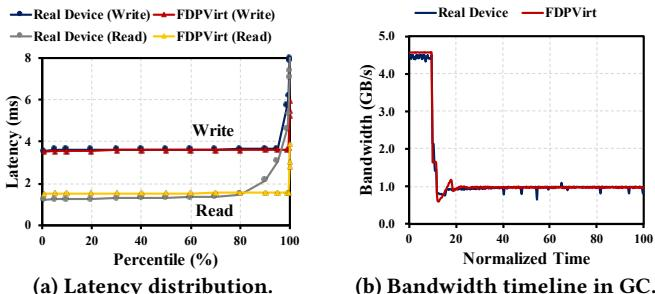

# Poster: FDPVirt: Investigating the Behavior of FDP SSDs

Joonyeop Park  Seoul National University  Seoul, South Korea  jonyeop@snu.ac.kr

Hyeonsang Eom  Seoul National University  Seoul, South Korea  hseom@snu.ac.kr

# Abstract

As SSDs become increasingly important in modern storage systems, research into optimizing their performance and endurance has intensified. Flexible Data Placement (FDP) has gained attention for improving SSD efficiency by optimizing data placement and reducing Garbage Collection (GC) overhead. This paper introduces FDPVirt, an SSD emulator based on NVMeVirt, designed to explore FDP strategies. Our evaluation shows that FDPVirt closely replicates the I/O characteristics of an FDP prototype and fine- grained data placement reduced the Write Amplification Factor (WAF) by up to  $26.3\%$  while dynamic adjustments to Reclaim Unit (RU) sizes further lowered WAF by  $8.3\%$ . FDPVirt provides insights that hardware- limited SSDs cannot, making it a valuable tool for future SSD optimization research.

# CCS Concepts

- Information systems  $\rightarrow$  Storage management.

# Keywords

SSD, NVMe, Flexible Data Placement, Write Amplification Factor

# ACM Reference Format:

Joonyeop Park and Hyeonsang Eom. 2024. Poster: FDPVirt: Investigating the Behavior of FDP SSDs. In 25th International Middleware Conference Demos, Posters and Doctoral Symposium (MIDDLEWARE Demos, Posters and Doctoral Symposium'24), December 2- 6, 2024, Hong Kong, Hong Kong. ACM, New York, NY, USA, 2 pages. https://doi.org/10.1145/3704440.3704792

# 1 Introduction

As NVMe storage devices advance, optimizing performance and extending lifespan remain critical challenges. A key issue is managing WAF, which affects both endurance and efficiency. Flexible Data Placement (FDP) [1] has emerged as a promising solution, aligning data with its expected lifespan, reducing data movement during Garbage Collection (GC), and improving overall SSD performance. However, the lack of prototype devices with FDP functionality limits academic research. To address this, we propose FDPVirt, an SSD emulator based on NVMeVirt [3], designed to emulate and evaluate FDP strategies without relying on real hardware.

This study examines FDPVirt in various aspects. First, we assess its ability to closely replicate the performance of an FDP Prototype device, particularly in terms of I/O characteristics like read/write latency and GC behavior. Second, we explore how fine- grained data placement strategy influences Write Amplification Factor (WAF),

  
Figure 1: Flash Translation Layer of FDPVirt.

showing that FDPVirt can reduce WAF by up to  $26.3\%$  for workloads which are composed of mixed write streams of various hotness levels. Additionally, we examine the impact of RU sizes on WAF, which further lowers WAF by  $8.3\%$ . These findings demonstrate that FDPVirt provides a versatile platform for investigating FDP strategies and optimizing SSD performance and endurance.

# 2 Design and Implementation

FDP requires to placing write streams that can be distinguished by Reclaim Units (RUs) from the user to dedicated flash memory addresses. To satisfy this requirement, FDPVirt extends the Flash Translation Layer (FTL) of NVMeVirt as shown in Figure 1. In the figure, each line (e.g., L0, L1, etc.) in the FTL represents a flash block, corresponding to a RU in FDP. These RUs allow efficient management by enabling independent reclamation during GC, thus reducing WAF. To implement FDP, we expand the Write Pointer (WP) system in FDPVirt. Rather than using a single WP, FDPVirt utilizes an array of WPs, where each WP points to a specific RU. This design enables dynamic data placement across multiple RUs, with data grouped by expected lifespan. The key to reducing WAF in FDPVirt lies in its fine- grained data placement, which minimizes the movement of long- lived data during GC, thus reducing internal writes and improving write performance and device endurance.

Additionally, FDPVirt tracks both external (host- driven) and internal (GC- driven) writes via the Units. Written field, as shown in Figure 1. This field helps calculate WAF enabling precise evaluation of FDP strategies. With these enhancements, FDPVirt accurately emulates the behavior of real FDP- enabled SSDs, offering a platform to assess the impact of advanced data placement strategies on performance, particularly in terms of WAF and latency.

# 3 Evaluation

The evaluation is conducted on an Intel i7- 12700K processor (2.70 GHz, 12 physical cores, 20 logical cores) with 64GB of DRAM, running Linux kernel 6.5.0. For comparison, we use a 4TB PCIe Gen 5- compatible Samsung FDP Prototype SSD, supporting up to 8 RUs. FDPVirt is configured with 2 cores and 16GB of memory to handle user I/O requests. We utilize micro- benchmark FIO [2], with custom workloads simulating various real- world I/O scenarios.

Emulating Performance Characteristics of the FDP Prototype: We assess FDPVirt's ability to emulate performance by measuring read and write bandwidth across I/O sizes from 4KB to 128KB using FIO.

  
Figure 2: Performance similarity between real device and FDPVirt on various I/O sizes.

As shown in Figure 2, the bandwidth difference between FDPVirt and the real FDP device is  $11.1\%$  for reads and  $4.1\%$  for writes, respectively, on average. Especially, FDPVirt shows more similar performance in larger I/O sizes. However, at smaller I/O sizes, the disparity increases due to firmware optimization in the real device, such as hardware- driven I/O automation that reduces firmware overhead. This optimization accelerates small I/Os in the real device. Despite this, FDPVirt closely mirrors the FDP prototype's performance, even considering complex SSD optimizations.

  
Figure 3: Latency and GC bandwidth similarity.

In addition to bandwidth, we evaluate the latency distribution for 32 KiB read and write requests, comparing FDPVirt with the real FDP Prototype SSD. As shown in Figure 3a, the latency distribution of both devices are remarkably similar, demonstrating the accuracy of FDPVirt in emulating real- world FDP device behavior under typical workloads. To evaluate the accuracy of emulation during SSD GC, we perform random writes followed by warming up (i.e., fill the whole device space with sequential writes). As seen in Figure 3b, both FDPVirt and the real device experience similar performance drops during GC, with FDPVirt closely replicating the real device's behavior, maintaining a steady performance after the initial drop. This further validates the effectiveness of FDPVirt in mimicking real- world conditions.

Impact of Fine- Grained Data Placement on WAF: We examine how data placement strategy on FDPVirt impacts write amplification by increasing the number of RUs from 1 to 16. In this evaluation, we use mixed workloads with various levels of hotness. To generate different hotness, each application thread submits I/Os at a different rate to its dedicated LBA range (i.e., higher I/O rate, hotter temperature). We group workloads that have similar hotness and make each group share the same RU. By distributing RUs to application threads in this manner, a higher number of RUs induces finer data placement by hotness. Because actively triggered GC is required to show the impact of fine- grained data placement on WAF, we sequentially fill the whole SSD space, before submitting writes with different hotness. As depicted in Figure 4, increasing the number of RUs leads to a reduction in WAF, with improvements of up to  $26.3\%$  observed. This highlights that granular control over data placement significantly lowers write amplification, particularly in workloads with the mixed pattern of various hotness levels, by distributing data more effectively across RUs.

  
Figure 4: Reduction in WAF as the number of RUs increases in workload distribution.

Impact of RU Size on WAF: RU size plays a critical role in affecting WAF. Smaller RUs offer finer granularity in data placement, reducing WAF by minimizing internal data movement and GC overhead. However, real- world devices often have fixed RU sizes, it is challenging to evaluate the impact of RU sizes. FDPVirt provides flexibility on RU sizes (i.e., user- configurable feature), enabling empirical evaluation of WAF. Our experiments show that halving the RU size reduces WAF by  $8.3\%$  (i.e., from 3.12 to 2.86) due to more efficient garbage collection and better data hotness alignment. In contrast, increasing RU size raises WAF to 4.48, showing that larger RUs are less effective with diverse workloads. While real FDP devices has inflexibility in RU size due to the closed modification of firmware and hardware in SSDs, FDPVirt offers a flexible platform to explore how RU size adjustments influence WAF. This flexibility provides valuable insights for future SSD designs, where tuning RU sizes based on workload characteristics could enhance performance and endurance.

# 4 Conclusion

This study demonstrated that FDPVirt accurately emulates FDP- enabled SSDs, replicating key aspects such as I/O characteristics, latency distribution, and garbage collection behavior. The evaluation result reveals that FDPVirt closely matches the performance of a real FDP prototype, validating its effectiveness in real- world conditions. By enabling fine- grained data placement strategies and dynamic RU size adjustments, FDPVirt effectively reduces write amplification by up to  $26.3\%$  and  $8.3\%$ , respectively, providing valuable insights that are difficult to obtain with hardware- constrained SSDs. Moving forward, future work will focus on integrating more FDP features and applying FDPVirt to real- world applications to further explore its potential for SSD optimization.

# Acknowledgement

This work was also supported in part by the Brain Korea 21 (BK21) FOUR Intelligence Computing (Department of Computer Science and Engineering, Seoul National University funded by the National Research Foundation of Korea (NRF) under Grant 4199990214639.

# References

[1] [n.d.]. NVMe 2.0 - TP 4146, FDP. https://nvmexpress.org/wpcontent/uploads/ NVM- Express- 2.0- RatifiedTPs_12152022. zip. Accessed: 2024- 06- 17. [2] J. Axboe. 2022. Flexible I/O Tester. https://github.com/axboe/fio. Available at https://github.com/axboe/fio. [3] S. H. Kim, J. Shim, E. Lee, S. Jeong, I. Kang, and J. Kim. 2023. NVMeVirt: A Versatile Software- defined Virtual NVMe Device. In 21st USENIX Conference on File and Storage Technologies (FAST 23). USENIX Association, Santa Clara, CA, 379- 394. https://www.usenix.org/conference/fast23/presentation/kim- sang- hoon